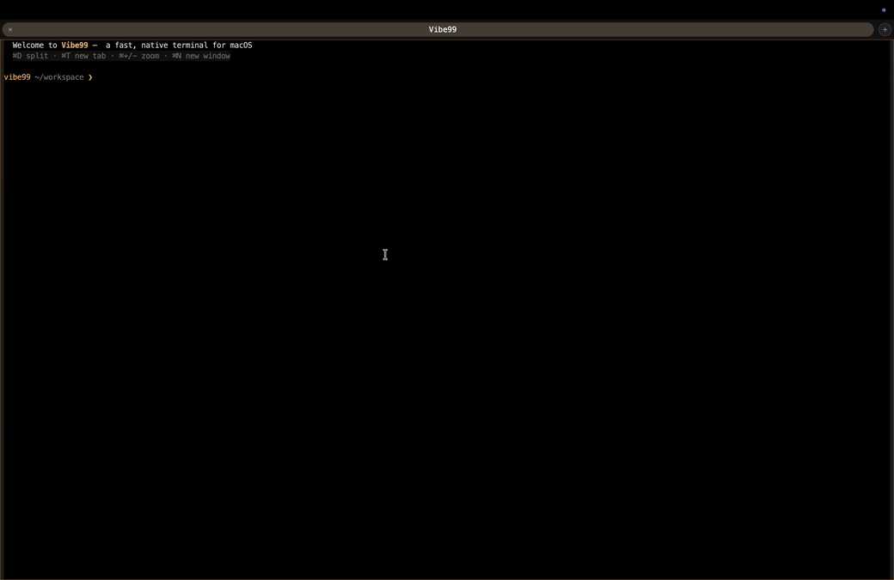

<!-- ================================================================
     taocy001 fork 改动说明（基于 NekoApocalypse/Vibe99 v0.7.2）
     ================================================================ -->

# taocy001 Fork 改动说明

本仓库是 [NekoApocalypse/Vibe99](https://github.com/NekoApocalypse/Vibe99) 的个人 fork，在上游 v0.7.2 基础上基于个人喜好进行了一些修改。以下按功能领域分类汇总所有改动。

> **平台说明：本 fork 仅面向 macOS。**  
> 所有开发与测试均在 macOS 上进行，不涉及 Windows 或 Linux。其中多项改动本身就是 macOS 专属（Dock 菜单、WKWebView IME、ProMotion 高刷优化、原生全屏处理等）。上游项目支持的其他平台在本 fork 中未经验证。

## 演示

多个标签各跑一个 AI CLI（claude / gemini / kimi）：聚焦标签全宽展开，其余标签作为**实时预览条**在后台持续滚动；支持左右切换标签、拖拽分割线调整聚焦标签宽度、深色 / 浅色主题一键切换。



> 演示在消毒环境中录制（自定义提示符、隐去真实路径与主机名，AI 会话为脚本模拟）。

---

## 新功能

### 终端能力
- **OSC 1337 内联图像渲染** — 通过 xterm ImageAddon 在终端中直接显示图片
- **OSC 133 Shell 集成** — 块级命令区域标记；支持块导航、概览标尺命令标记，以及命令完成后的系统通知（可配置静默模式与超时时长）
- **终端搜索** — 内置搜索栏，支持正则切换和跨窗格搜索

### 窗格与布局
- **窗格分割** — 支持水平/垂直分割，拖拽分割线调整比例，预设比例快速切换
- **多窗口支持** — 通过 Dock 菜单新建独立窗口，关闭行为符合 macOS 规范
- **窗格拖拽分割线调整宽度** — 可实时拖拽调整窗格占比

### SSH 管理
- **SSH 连接管理** — 在菜单栏集成 SSH profile 管理；增删 SSH profile 后菜单自动重建，无需重启

### 外观与主题
- **亮色模式** — 新增暖珍珠色亮色主题，支持深色/亮色/跟随系统三种模式
- **Nerd Font 字体预设** — 内置含 Nerd Font 符号的字体回退栈
- **字体选择器** — 基于 canvas 的字体检测，动态分组（Available / Popular）

### 输入与快捷键
- **广播输入** — `⌘⇧B` 将键盘输入同时发送到所有窗格
- **字体缩放** — `Cmd+` / `Cmd-` / `Cmd+0` 实时调整字体大小
- **iTerm2 兼容快捷键** — 沿用 iTerm2 习惯的标签导航等快捷键

### 国际化
- **多语言界面** — 支持英语、简体中文、繁体中文、日语四种界面语言

---

## 界面改进

- **标签栏重新设计** — 等宽标签、圆角外观、精简关闭按钮
- **菜单栏重新设计** — 新增 Edit / View / Window / Help 标准菜单
- **设置面板重新设计** — 多标签分页，子设置页通过内联导航切换（不再弹出模态框）
- **键盘快捷键配置** — 可在设置中自定义所有操作的快捷键
- **macOS 标题栏配置** — 可调整原生标题栏显示方式
- **状态栏** — 可配置底部状态栏格式与提示项；支持显隐切换
- **面板标题显示当前目录** — 面板标题栏实时跟踪 OSC 7 更新的工作目录
- **右键菜单增强** — 丰富的上下文菜单操作
- **选中即复制** — 新增 copyOnSelect 设置（默认关闭）

---

## 性能优化

- **GPU 合成** — 启用 GPU 合成层、RAF 节流，减少不必要重绘
- **120Hz ProMotion 平滑滚动** — 针对 MacBook Pro 高刷屏优化滚动帧率
- **后台窗格写入缓冲** — 非激活标签的 xterm 写入先缓冲，切换时再一次性 flush，降低后台 CPU 占用
- **PTY 读取批量合并** — 短读时批量合并输出，减少 Tauri IPC 事件频率
- **消除标签点击 180ms 延迟** — 移除双击检测的 debounce，Tab 切换即时响应
- **字体加载完成后再 fit** — 等待 `document.fonts.ready` 后再执行首次 xterm fit，避免字符宽度测量错误

---

## 安全加固

- **内容安全策略（CSP）** — 启用严格 CSP，消除 XSS 攻击面
- **Tauri Capabilities 最小化** — 移除未使用的原生权限
- **SSH profile 参数白名单** — SSH args 仅允许安全参数（`-t`、`-p`、`-i`、`-l`、`--`），拦截 `-o ProxyCommand` 等注入
- **Shell 命令注入防护** — 非 SSH profile 的 `command` 字段过滤控制字符并拒绝以 `-` 开头的值
- **非 HTTP(S) 链接打开确认** — 终端超链接中的非 http/https 协议在打开前弹出确认对话框
- **OSC 7 路径校验** — 对 OSC 7 上报的工作目录进行合法性校验
- **事件监听器生命周期管理** — 使用 AbortController 精确清理事件监听器，`beforeunload` 统一注销全局 window 监听器

---

## 代码质量

- **renderer.js 模块化拆分** — 将单体 renderer.js 拆分为 4 个职责清晰的模块
- **Rust 错误处理改进** — SSH config 读取区分文件不存在与读取错误；PTY destroy 改为非阻塞
- **单元测试** — 新增关键路径单元测试
- **CJK / IME 输入修复** — 修复 WKWebView 下中文 Pinyin 输入法组合态检测、stale isComposing、标点符号等多个问题

---

<!-- ================================================================
     以下为原始 README（保持不动）
     ================================================================ -->

---

<p align="center">
  
</p>

<h1 align="center">Vibe99</h1>

<p align="center">
  Desktop terminal workspace for agentic coding.
</p>

Vibe99 is a Tauri desktop terminal workspace for agentic coding. It is built for the common case where one terminal needs full attention while several others only need peripheral visibility, so the UI keeps one pane readable and stacks the rest so you can still see what agents are doing.


## Quick Start

Install dependencies and start the Tauri dev app from this repository:

```bash
npm install
npm run tauri:dev
```

`npm run tauri:dev` starts Vite on `http://localhost:1420` and then launches the native Tauri shell. If Cargo is too old, update Rust with:

```bash
rustup update stable
```

Build release artifacts with:

```bash
npm run tauri:build
```

## Features

- **Custom pane colors** — each pane can have its own accent color for quick visual identification.
- **Activity alerts** — backgrounded panes with settled output show a pulsing breathing mask, with global and per-pane toggles.
- **Command palette** — quick tab switching via a searchable palette.
- **Configurable shortcuts** — keyboard shortcuts can be edited in the settings modal.
- **Session restore** — pane layout, directories, shell profiles, and tab titles are preserved across restarts.
- **WSL integration** — auto-detects all installed distributions and creates a shell profile for each one.
- **Font selection** — pick any installed monospace font from settings.

## Controls

| Shortcut | Action |
|---|---|
| `Cmd+N` / `Ctrl+N` | Add a new pane |
| `Ctrl+Tab` | Cycle to the most recently visited pane (add `Shift` to reverse) |
| `Cmd+Shift+O` / `Ctrl+Shift+O` | Open the command palette (jump to any pane) |
| `Ctrl+Left` / `Ctrl+Right` | Spatial navigation between panes |
| `Ctrl+B` | Enter navigation mode (`H`/`L` or arrows to move, `Enter` to focus) |
| `Ctrl+Shift+C` / `Ctrl+Shift+V` | Copy / paste in the focused terminal |
| double-click tab | Rename it |
| drag tab | Reorder panes |
| top-right `+` | Add a pane |
| top-right gear | Open display settings |

Shortcuts are configurable from the gear menu → Keyboard Shortcuts.

## Platform Defaults And Known Issues

- Terminal font defaults are platform-aware: `Consolas` on Windows, `Menlo` on macOS, and `DejaVu Sans Mono` on Linux.
- WSL integration is available on Windows and is a no-op on macOS/Linux.
- Known issue: the native macOS title bar can remain light while the system is in dark mode. See [issue #28](https://github.com/NekoApocalypse/Vibe99/issues/28).

## Stack

- Tauri 2
- Vite
- Rust
- `portable-pty`
- `xterm.js`
- `@xterm/addon-fit`
- `@xterm/addon-web-links`
- `@xterm/addon-webgl`

## Contributing

See [CONTRIBUTING.md](./CONTRIBUTING.md).
